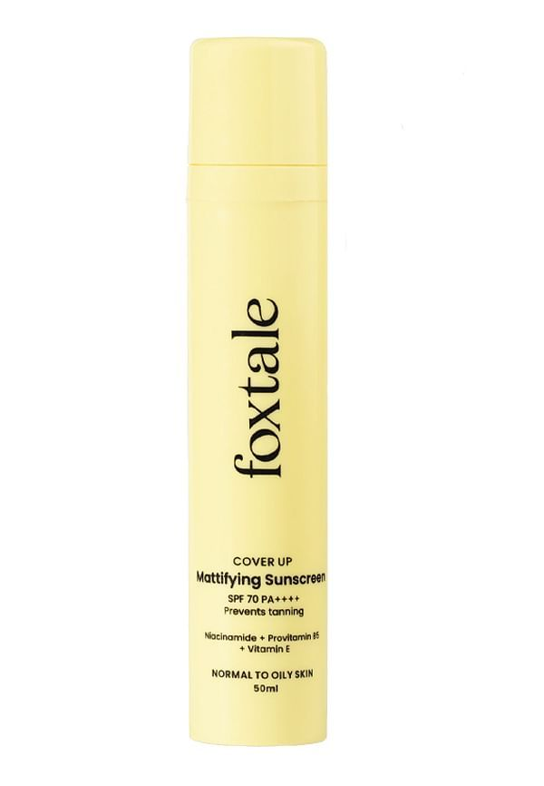

# Product_card
## Date: 09-07-2025
## Objective:

To replicate a product card layout similar to those found on real-time e-commerce platform like FlipKart using the CSS Box Model (margin, border, padding, and content).

## Tasks:

#### 1. Structure the HTML Layout:
Create a container ```<div>``` for the product card.

Add an `````` for the product image.

Include ```<h2>``` for product name, ```<p>``` for description, and a ```<span>``` or ```<div>``` for price.

Add a “Buy Now” or “Add to Cart” button.

#### 2. Apply Box Model Styling in CSS:
Use padding inside each section (image, text, button) to ensure readability.

Use margin around the card to space it from the page edges or other cards.

Add a border to outline the card.

Control width and height for consistent sizing.

#### 3. Visual Styling:
Add a background color to the card container.

Use box-shadow to simulate depth (card lifting effect).

Add border-radius for rounded corners.

#### 4. Center the Card:
Use display: flex and justify-content: center and align-items: center on the parent container.

#### 5. Bonus Enhancements:
Use a hover effect on the button (e.g., background color change).

Make the card responsive with percentage-based widths or media queries.

## HTML Code:
```
<!DOCTYPE html>
<html lang="en">
    <head>
        <title>FlipKart</title>
        <link rel="stylesheet" href="styles.css">
    </head>

    <body>
            <nav>
                  <div class="logo">FLIPKART</div> 
                <ul class="nav-links">
                    <li><a href="#">Login</a></li>
                    <li><a href="#">Cart</a></li>
                    <li><a href="#">Become a Seller</a></li>
                   
                </ul>
            </nav>    
        
                <div class="row">
                  <div class="card">
                       
                        <h3>BRMUD Recovery Clay Mud Face Mask</h3>
                      <div class="button-arrange">
                        <button type="button"> <p>Buy Now</p> </button>
                        <button type="button"> <p>Add to Cart </p></button>
                      </div>
                    </div>

                    <div class="card">
                       
                        <h3>The Ordinary Alpha Arbutin 2%</h3>
                        <div class="button-arrange">
                        <button type="button"> <p>Buy Now</p> </button>
                        <button type="button"> <p>Add to Cart </p></button>
                      </div>
                    </div>

                    <div class="card">
                       
                        <h3>Loreal 72H Moisture Filling 
                            Shampoo
                        </h3>
                        <div class="button-arrange">
                        <button type="button"> <p>Buy Now</p> </button>
                        <button type="button"> <p>Add to Cart </p></button>
                      </div>
                    </div>

                    <div class="card">
                       
                        <h3>CeraVe Renewing Salicyclic Acid Cleanser</h3>
                        <div class="button-arrange">
                        <button type="button"> <p>Buy Now</p> </button>
                        <button type="button"> <p>Add to Cart </p></button>
                      </div>
                    </div>

                    <div class="card">
                       
                        <h3>Foxtale Mattifying Sunscreen</h3>
                        <div class="button-arrange">
                        <button type="button"> <p>Buy Now</p> </button>
                        <button type="button"> <p>Add to Cart </p></button>
                      </div>
                    </div>
                </div>
           

           
                <div class="row">
                  <div class="card">
                       
                        <h3>Dot & Key Ceramide Moisturizer</h3>
                        <div class="button-arrange">
                        <button type="button"> <p>Buy Now</p> </button>
                        <button type="button"> <p>Add to Cart </p></button>
                      </div>
                    </div>

                    <div class="card">
                       
                        <h3>Biolage Deep Smoothing Hair Serum</h3>
                        <div class="button-arrange">
                        <button type="button"> <p>Buy Now</p> </button>
                        <button type="button"> <p>Add to Cart </p></button>
                      </div>
                    </div>

                    <div class="card">
                       
                        <h3>CosRX Snail Mucin Essence
                        </h3>
                        <div class="button-arrange">
                        <button type="button"> <p>Buy Now</p> </button>
                        <button type="button"> <p>Add to Cart </p></button>
                      </div>
                    </div>

                    <div class="card">
                       
                        <h3>Glow Recipe PHA + BHA Pore-Tight Toner</h3>
                        <div class="button-arrange">
                        <button type="button"> <p>Buy Now</p> </button>
                        <button type="button"> <p>Add to Cart </p></button>
                      </div>
                    </div>

                    <div class="card">
                       
                        <h3>Foxtale Mattifying Sunscreen</h3>
                        <div class="button-arrange">
                        <button type="button"> <p>Buy Now</p> </button>
                        <button type="button"> <p>Add to Cart </p></button>
                      </div>
                    </div>
                </div>
            
    </body>
</html>
```

## CSS Code:
```
* {
    box-sizing: border-box;
}

body {
  background-color: #f1f3f6;
  font-family: 'Segoe UI', Tahoma, Geneva, Verdana, sans-serif;
  overflow-y: scroll;
}

nav {
  display: flex;
  justify-content: space-between;
  align-items: center;
  background-color: #ffffff;
  padding: 15px 30px;
  box-shadow: 0 4px 6px -2px rgba(0,0,0,0.6);
}

.logo {
  font-size: 24px;
  font-weight: bold;
  color: darkblue;
}

.nav-links {
  list-style: none;
  display: flex;
  gap: 25px;
}

.nav-links li a {
  color: #172337;
  text-decoration: none;
  font-weight: 500;
}

.nav-links li a:hover {
  border-bottom: 2px solid #2874f0;
  padding-bottom: 2px;
}

h3 {
  color: #172337;
  font-weight: bold;
  text-align: center;
}

img {
  height: 40vh;
  padding: 20px;
  width: 15vw;
  border: 1px solid black;
  border-radius: 7px;
}

.row {
  display: flex;
  justify-content: space-between;
  margin-top: 30px;
  margin-left: 30px;
  margin-bottom: 30px;
}

.card {
  background-color: #fff8e1;
  border: 2px solid black;
  border-radius: 8px;
  width: 40%;
  margin-right: 20px;
  margin-bottom: 40px;
  padding: 20px;
  box-shadow: 0 2px 6px rgba(0, 0, 0, 0.1);
}

.card:hover {
  transform: translateY(-10px);
  box-shadow: 0 12px 20px rgba(0, 0, 0, 0.2);
}

button {
  padding: 5px;
  border-radius: 8px;
  background-color: #ffd814;
  margin-bottom: 20px;
  border: none;
  font-weight: bold;
  color: #172337;
}

p {
  font-weight: bold;
}

.button-arrange {
  display: flex;
  flex-direction: column;
}

```
## Output:


## Result:
A product card layout similar to those found on real-time e-commerce platform like FlipKart using the CSS Box Model is replicated successfully.
